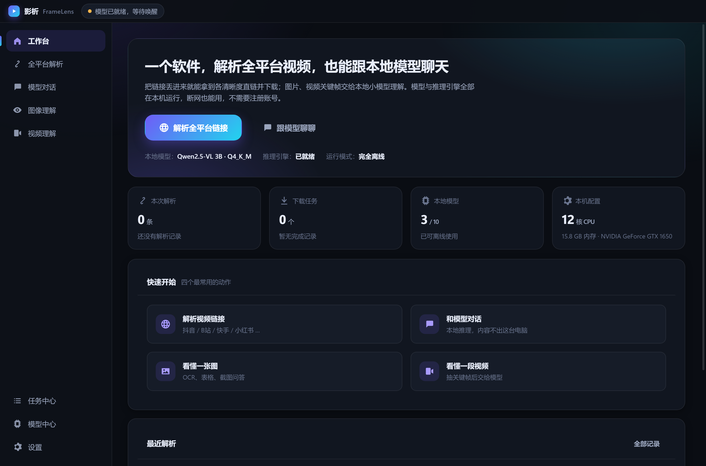
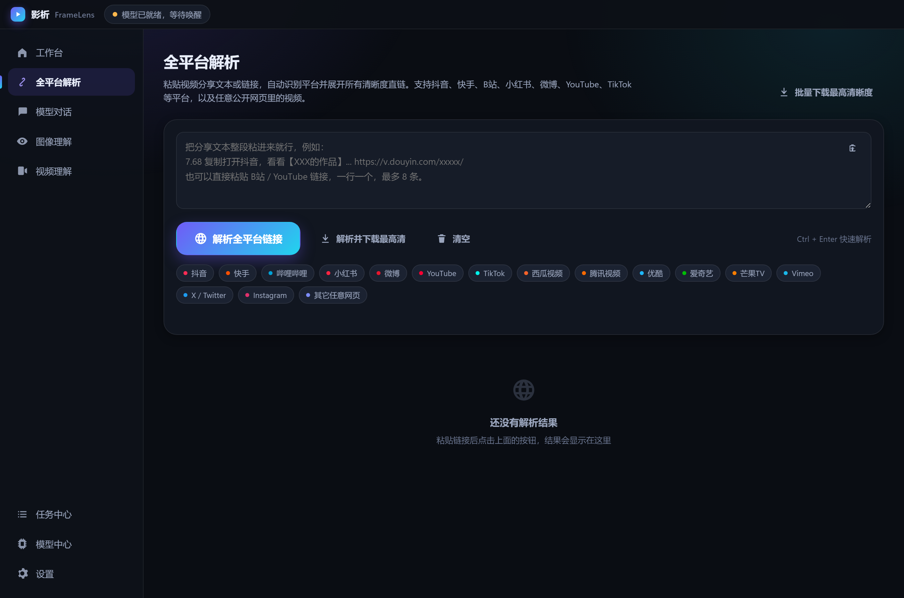
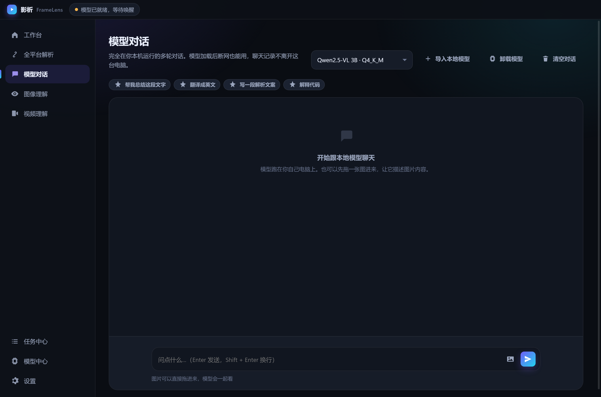
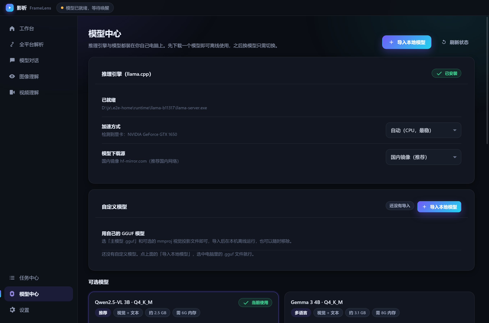

# 影析 FrameLens

**一个软件，解析全平台视频/图片，也能跟本地模型聊天。**

粘贴视频分享文本或链接，自动识别平台、展开所有清晰度直链；封面与图文原图一起解析出来，
视频、图片各带独立下载按钮。内置小模型与推理引擎全部跑在你的设备上，
**断网可用、不注册账号、不上传任何内容**。

Windows 与 Android 双端同源，安装包内已带完整模型——**下载、安装、直接用**，不需要再下任何东西。

---

## 下载安装（最新版 v1.0.0）

只提供当前最新版本，两个安装包均为**全内置**：模型 + 推理运行时都在包里。

| 平台 | 安装包 | 大小 | 说明 |
|---|---|---|---|
| Windows 64 位 | [FrameLens-1.0.0-Windows-x64-Full-Setup.exe](https://github.com/xiaoluo139/FrameLens/releases/download/v1.0.0/FrameLens-1.0.0-Windows-x64-Full-Setup.exe) | 1.58 GB | 一键安装（NSIS，不用选目录），装完即用 |
| Android（arm64-v8a） | [FrameLens-1.0.0-Android-arm64-Full.apk](https://github.com/xiaoluo139/FrameLens/releases/download/v1.0.0/FrameLens-1.0.0-Android-arm64-Full.apk) | 1.60 GB | 传到手机点安装即可 |

全部版本见 [Releases](https://github.com/xiaoluo139/FrameLens/releases)（当前只有一个最新版）。

> 装完打开就能用：右上角状态显示「本地模型已就绪」说明模型已经加载好，可以直接解析或提问。
> 手机安装时 vivo/小米等会提示「外部来源应用」，勾选「已知晓风险」再点「继续安装」即可。

### 校验下载文件（可选）

```
FrameLens-1.0.0-Windows-x64-Full-Setup.exe
sha256  4c41757160fea6465df6e2c9978d494178c64c379be9ed47f374975869f20a5f

FrameLens-1.0.0-Android-arm64-Full.apk
sha256  6cdc865da88aa59f3853c60df5c0f4fc290184ff09f247f5a5528a7f24637c84
```

## 界面









## 两条主线

### 一、全平台解析（页面解析 + 本机下载）

- 一个「解析全平台链接」按钮：粘贴分享文本，自动识别平台并展开全部清晰度
- **视频与图片双解析**：清晰度逐条可选，封面图与图文原图单独成区，各有独立下载按钮
- 覆盖抖音、快手、B站、小红书、微博、西瓜、TikTok、YouTube、腾讯视频、优酷、
  爱奇艺、芒果TV、Vimeo、X、Instagram，以及任意公开网页里的视频
  （OG / JSON-LD / video 标签 / 内嵌 JSON 多路兜底）
- 抖音这类已封服务端抓取的站点，改用隐藏浏览器真实渲染页面并拦截媒体请求
- HLS（m3u8）多码率自动展开成 4K、1080P、720P 等逐条可选
- 内置下载器：断点续传、并发调度、停滞看门狗、HLS 分片合并

### 二、本地模型对话与视觉理解（完全离线）

- 随包内置 llama.cpp 运行时与多模态模型（SmolVLM2 2.2B），启动即在后台预热
- 模型对话：多轮上下文、流式输出、图片可直接拖进对话窗口
- **自定义模型**：可导入自己的 GGUF（主模型 + mmproj），在「模型中心」或「模型对话」页一键导入、切换、移除
- 也可在模型中心一键下载更大模型（如 Qwen2.5-VL 3B，中文与 OCR 更强），并带模型自检
- 图像理解：描述、OCR 提取文字、表格转 Markdown、翻译
- 视频理解：不依赖 ffmpeg，用 Chromium 解码抽关键帧再交给视觉模型
- 空闲自动卸载模型释放内存；全程离线，内容不出本机

## 从源码运行

```
npm install
npm start
```

## 打包

```
npm run build:win       精简版安装包（不含模型，首次使用时下载）
npm run build:win:full  全内置版，模型与运行时一起打进去，装机即用
```

产物在 `release/`，NSIS 一键安装，双击、安装、直接用，不需要选择目录。

移动端 Android：

```
cd mobile
npm install
npm run android:release
```

详细说明见 [docs/BUILD.md](docs/BUILD.md)。

## 工程结构

```
core/                     纯逻辑层，不依赖 Electron，可单独测试
  extract/                解析引擎：平台注册、HTML/HLS 抽取、各平台解析器、下载器
  model/                  推理层：运行时自举、模型目录、服务进程、硬件探测
  http.js store.js zip.js 传输、配置、自研 ZIP 解包
electron/                 主进程、受控 IPC 桥、本地文件协议、隐藏渲染窗口
src/                      渲染层：无框架无打包器的设计系统与 8 个页面
mobile/                   Capacitor Android 工程，复用 core/extract
tests/                    31 个单元与集成测试，含本地 HTTP 服务的端到端解析
scripts/                  图标生成、模型预取、打包、语法检查、自检
```

架构细节见 [docs/ARCHITECTURE.md](docs/ARCHITECTURE.md)。

## 验证

```
npm test          31 个测试，含真实跑通「网页 -> HLS 多清晰度 -> 归一化」链路
npm run check     全量语法检查
npm run smoke     启动应用，自检页面挂载、遮罩层、自定义模型入口
npm run shot      逐页截图到 shots/
npm run e2e       真的去点界面按钮：解析真实链接 -> 下载 -> 检查任务是否完成
npm run e2e:full  再加模型对话与图像理解（需要已装模型）
npm run e2e:import 真的点「导入本地模型」：复制 GGUF -> 登记 -> 出现在界面
npm run e2e:online 打真实平台测解析
```

跑过什么、没跑什么，逐条记在 [docs/VERIFICATION.md](docs/VERIFICATION.md)。

## 使用须知

本软件只提供本地解析与本地推理能力，不托管、不转存任何内容。
请遵守各平台服务条款与著作权法规，仅下载你有权保存的内容。

## 许可

MIT。内置模型来自各自开源仓库（SmolVLM2、Qwen2.5-VL 等），遵循其原始许可；
推理运行时来自 llama.cpp（MIT）。
